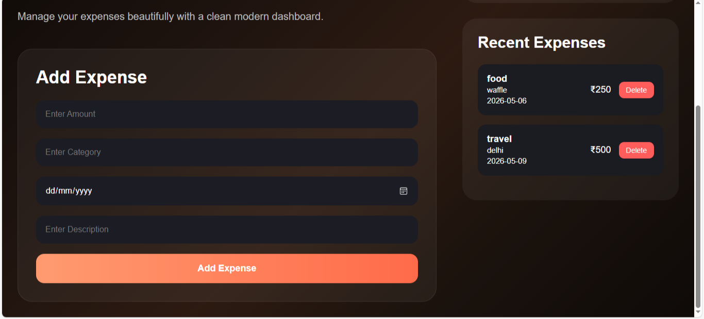
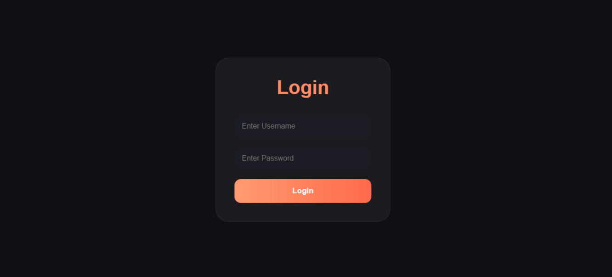
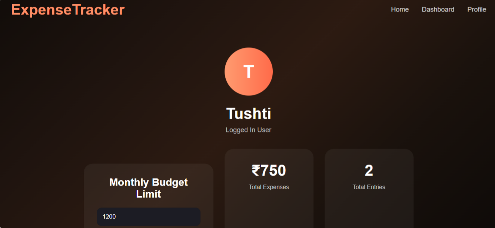

# ExpenseTracker

A full-stack expense tracker web application built using Java, Spring Boot, HTML, CSS, and JavaScript.

## Features
- User login page
- Expense dashboard
- Expense tracking system
- Responsive frontend UI
- Backend integration using Spring Boot
- Profile page
- Clean and modern interface

## Tech Stack
- Java
- Spring Boot
- HTML
- CSS
- JavaScript
- Maven

## Project Structure
- Frontend: HTML, CSS, JavaScript
- Backend: Spring Boot (Java)
- Build Tool: Maven

## How to Run
1. Clone the repository
2. Open the project in IntelliJ IDEA
3. Run `ExpenseTrackerApplication.java`
4. Open browser and visit:
   ```bash
   http://localhost:8080
   ```

## Future Improvements
- Database integration
- Authentication system
- Expense analytics
- Charts and reports

  ## Screenshots

### Dashboard


### Login Page


### Profile Page


## Author
Tushti Sharma

